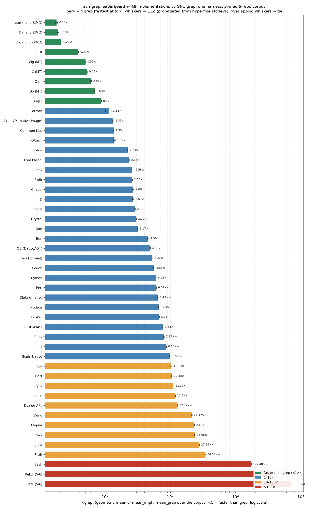

# asmgrep

A small but genuinely fast **grep replacement** — literal (fixed-string)
substring search with recursion and case-insensitivity — originally written in
**x86-64 Linux assembly** with **no libc** (just raw syscalls). On real
repositories it runs **~3× faster than GNU grep and ~2× faster than ripgrep**
(geomean, aligned flags), with byte-for-byte identical results.

This repo is also an **experiment**: the same program is reimplemented in **C**,
**C++**, **Zig**, **Go**, **Rust**, **Odin**, **D**, **Java**, **C#**, **Kotlin**, **Clojure**,
**Common Lisp**, **Haskell**, **OCaml**, **FreePascal**, **Ada**, **Fortran**,
**Python**, **JavaScript**, **LuaJIT**, **awk**, **Crystal**, **Elixir**, **Swift**, **Red**, **Pony**, **Nim**, **Julia**, and **Chapel** —
both *hand-optimized* (same syscall strategy, SIMD, parallel walker)
and *idiomatic stdlib*. The question: *did writing it in assembly buy any of the speed,
or was it the engineering all along?* **Answer below; the short version is: within the
compiled tier it's the engineering, not the language — but for managed JVM runtimes the
startup/warmup tax on a short-lived process becomes the whole story, and across the
scripting runtimes what spreads results ~200× is *which concurrency primitive is
idiomatic* (not the JIT): LuaJIT's near-free `fork()` ties grep, while gawk — with no
concurrency at all — lands three orders of magnitude behind.**

```
grep [-r] [-i] PATTERN PATH...
  -r   recurse into directories
  -i   case-insensitive (ASCII)
  --   end of options
```

Literal substring only — **no regex** (compare against `grep -F` / `rg -F`).
Exit status: `0` = match, `1` = no match, `2` = error.

> ### 🏁 [**The complete leaderboard → docs/LEADERBOARD.md**](docs/LEADERBOARD.md)
> All **48 implementations** ranked on one harness against a pinned public corpus (6 repos). Nine beat
> GNU grep; the spread top-to-bottom is ~3,900×, sorted almost entirely by *runtime model, not language*.
> The tables below are excerpts.



*×grep = geomean of mean(impl)/mean(grep) over the corpus (<1 = faster than grep). Whiskers are the
**±1σ** propagated from hyperfine's per-measurement stddev — where two bars' whiskers overlap, the
ordering between them isn't statistically meaningful (e.g. the top trio **asm / C / Zig are a tie**).
Regenerate with `python3 tests/plot_leaderboard.py`.*

## Findings

All implementations are **byte-for-byte identical to grep** on every repo tested.
Geomean slowdown vs the hand-written assembly, `-ri error`, 10 repos, 6 cores
(full numbers + methodology in **[docs/RESULTS.md](docs/RESULTS.md)**):

| implementation | vs asm |
|---|--:|
| **optimized** asm / C / Zig (same algorithm + syscall strategy) | 1.0× / ~1.0× / ~1.05× |
| ripgrep | 2.8× |
| GNU grep | 4.6× |
| **idiomatic** single-threaded (C / Zig / Go) | ~14× |
| **idiomatic** + naive threads (C / Zig / Go / Rust) | ~9.7× |
| **idiomatic** + threads + reused buffer + prefix binary-check | **C 3.2× / Zig 2.8× / Go 4.4× / Rust 2.4×** |

### 🏁 Leaderboard — 29 languages, best shipped variant (plus 12 more below)

> **For the complete, current board (all 48 implementations on one pinned-corpus harness) see
> [docs/LEADERBOARD.md](docs/LEADERBOARD.md).** The two tables below are the earlier single-repo /
> synthetic-tree snapshots, kept for the per-corpus narrative.

One harness, one repo: `-ri error` on **navidrome (29 MB, warm cache)**, each implementation's fastest
binary, vs GNU grep (`-rIiF`, same run). `×grep` < 1 means *faster than grep*.

| # | impl | ×grep | startup | tier |
|--:|---|--:|--:|---|
| 1 | **C** | **0.23×** | ~0.5 ms | native, hand-SIMD |
| 2 | **Zig** | **0.27×** | ~0.5 ms | native, hand-SIMD |
| 3 | **asm** | **0.32×** | ~0.3 ms | freestanding, hand-SIMD |
| 4 | **Rust** | **0.47×** | ~0.5 ms | native (walkdir+rayon+memchr) |
| – | _ripgrep_ | _0.52×_ | ~0.5 ms | _reference_ |
| 5 | **C++** | **0.65×** | ~0.5 ms | native, idiomatic+tuned |
| 6 | **Go** | **0.81×** | ~0.5 ms | native (goroutines) |
| 7 | **Swift** | **0.93×** | 2.5 ms | native + ARC |
| 8 | **Nim** | **0.98×** | 0.7 ms | native (scan-bound) |
| – | _GNU grep_ | _1.00×_ | ~0.5 ms | _reference_ |
| 9 | **LuaJIT** | 1.03× | 2.6 ms | JIT scripting (`fork`) |
| 10 | **D** | 1.24× | 0.8 ms | native + GC |
| 11 | **GraalVM** | 1.49× | 2.4 ms | native-image (AOT'd Java) |
| 12 | **OCaml** | 1.56× | 1.0 ms | native (Domains) |
| 13 | **Common Lisp** | 1.62× | 3.4 ms | SBCL native image |
| 14 | **Crystal** | 1.87× | 1.1 ms | native + GC |
| 15 | **Odin** | 2.08× | 0.6 ms | native |
| 16 | **Ada** | 2.36× | 0.6 ms | native (tasks) |
| 17 | **Fortran** | 2.44× | 0.8 ms | native (OpenMP) |
| 18 | **FreePascal** | 2.48× | 0.4 ms | native |
| 19 | **Pony** | 3.00× | 5.4 ms | native actors (scan-bound) |
| 20 | **C#** | 3.04× | 1.6 ms | NativeAOT |
| 21 | **Chapel** | 3.78× | 28 ms | native HPC (scan-bound + qthreads boot) |
| 22 | **Haskell** | 4.82× | 17 ms | native + RTS |
| 23 | **Clojure-native** | ~6.5× | 2.9 ms | native-image (AOT'd Clojure — the loop-closer) |
| 24 | **JavaScript** | 6.6× | 32 ms | V8 (`worker_threads`) |
| 25 | **Python** | 10.6× | 15 ms | CPython (multiprocessing) |
| 26 | **Kotlin** | 16.3× | ~35 ms | JVM — startup-bound |
| 27 | **Java** | 17.8× | 30 ms | JVM — startup-bound |
| 28 | **Clojure** | 38.7× | ~450 ms | JVM AOT — startup-bound |
| 29 | **Elixir** | 43.1× | ~480 ms | BEAM — startup-bound |
| 30 | **Julia** | 47.7× | ~470 ms | JIT — startup-bound (JIT-compile tax) |
| 31 | **awk** | 80.7× | 3.7 ms | interpreted (gawk) |
| 32 | **Red** | 671× | 19 ms | interpreted (Rebol-family) |

**Read it as short-job-weighted.** On a 29 MB tree the scan is small, so *startup* is a big share of
the total — which is exactly why the VM/JIT runtimes (Java, Clojure, Elixir, Julia) sit at the bottom.
On a large tree the scan amortizes their boot and they climb sharply: Julia 47.7× → ~18× on immich,
Java 17.8× → ~8×, Elixir 43× → ~15×. The top of the board (asm/C/Zig hand-SIMD, then the idiomatic-tuned
native cluster down through Haskell) is stable across repo sizes. And GraalVM `native-image` *removes*
the startup tax outright for the two AOT-able JVM languages: that's the **GraalVM** row above (AOT'd
Java, 1.49×), and `make clojure-native` drops **Clojure 38.7× → ~6.5×** (startup 2.9 ms). **Nine
implementations beat GNU grep; the spread top-to-bottom is ~2900×, sorted almost entirely by runtime
model.**

**Twelve more, one batch later** — the scripting/shell floor, two more loop-closers, an exotic VM, more
AOT natives, two array/APL languages, and a stack language. Measured on a **separate synthetic 36 MB tree**
(3,600 files; *not* the repo corpus above — anchors on this tree: GNU grep = 1.00×, Python 4.5×, awk 105× —
so read the **ordering**, not the absolute multiplier across tables; full methodology in RESULTS.md):

| impl | ×grep (36 MB tree) | startup | runtime model |
|---|--:|--:|---|
| **Codon** | 7.0× | 8.5 ms | Python *syntax* → native (LLVM AOT) — the Python loop-closer |
| **Ruby** (CRuby) | 7.5× | 45 ms | interpreted glue, C-backed `String#index` scan |
| **J** (jsoftware) | 8.6× | 54 ms | array lang; `E.` is a C primitive ⇒ **native cluster** |
| **Rust→WASI** | 9.8× | 14 ms | native Rust on `wasm32-wasip1` under wasmtime (sandbox tax) |
| **Scala-Native** | 10.0× | 2.0 ms | the same Scala, AOT'd via LLVM — no JVM, no startup tax |
| **Dart** | 12.7× | 2.6 ms | native self-contained exe |
| **Dyalog APL** | 22× | 313 ms | canonical APL; C-backed `⍷` scan (fast like J) but **startup-bound** on a 313 ms VM boot |
| **PyPy** | 71× | 52 ms | the **unchanged** `grep_std.py` under a tracing JIT (startup-bound here) |
| **Bash** | 230× | 3.4 ms | pure-shell floor; no concurrency primitive (`_std` only) |
| **Raku** (MoarVM) | 471× | 484 ms | bytecode VM whose boot dominates — startup-bound |
| **Forth** (gforth) | >6000× | 6.0 ms | interpreted byte-at-a-time scan — the **bottom of the board** |

Same lesson, three ways. **J** (array language) lands among the natives because its scan primitive is C,
while **Forth** is the floor because its scan is interpreted byte compares — *same "interpreted language"
label, opposite result*, decided only by whether the hot loop bottoms out in C. And **Dyalog APL** sharpens
it inside the array family: its `⍷` scan is C-backed and fast *like J's*, yet its interpreter boot dropped
it into the startup-bound tier — two array languages, same fast scan, sorted apart by startup model alone.
(*Update:* most of that "313 ms boot" turned out to be **Dyalog 19 spawning a CEF/Chromium HTMLRenderer at
startup** even for a headless script — disabling it with `ENABLE_CEF=0` cuts startup to **~51 ms**, output
byte-identical, and on the pinned corpus Dyalog improves to **13.5×**. So the boot tax was real but largely
a GUI artifact, not inherent interpreter cost — Dyalog sits closer to J than the 313 ms framing implied.
See [docs/LEADERBOARD.md](docs/LEADERBOARD.md) and RESULTS.md.) GNU APL was also attempted but couldn't pass
the harness on this machine's broken `gnu-apl 1.9-1` build, so **J** and **Dyalog** are the array-language
representatives.

The twenty-five before them (consistent single-pass benchmark, see RESULTS.md) likewise sort by
**runtime model**, not syntax:

| implementation | character |
|---|---|
| **C++** (g++, idiomatic Modern C++23) | native compiled tier; **ties idiomatic C at every tier** (std 1.04×, tuned-MT 3.0× vs asm ≈ C, ~1.5× faster than GNU grep). Instructive: the first cut was 1.33× slower than C, and instrumentation showed the tax was **not** the abstractions (`filesystem`/`ifstream`/`format_to`/`string_view::find` are ~free) but a hidden `memset` — `std::vector::resize` zero-fills before `read()` overwrites, writing every byte twice (~78% of the user-CPU gap). Fixed with `std::make_unique_for_overwrite`/`resize_and_overwrite`. See RESULTS.md |
| **Odin** (compiled, native) | lands in the C/Zig idiomatic cluster (~3.5× single-threaded); sub-ms startup |
| **D** (dmd, native + GC) | **0.8 ms** startup — lands squarely in the native compiled tier; mutable arrays ⇒ the buffer-reuse pillar works, so tuned-MT scales ~5× and lands within ~1.3× of GNU grep; hand-rolled-search algorithm tax single-threaded |
| **C#** (.NET 10 NativeAOT) | true native ELF, **1.6 ms** startup (no VM); vectorized `Span<byte>.IndexOf` scans 454 MB in **77 ms of CPU (5.9 GB/s)** — *less total work than anything else here*, landing ahead of D and near grep. Threading then buys nothing because, like grep itself, it's no longer scan-bound — I/O / per-file syscalls become the floor (see RESULTS.md) |
| **Common Lisp** (SBCL native image) | ~3.4 ms startup, tuned-MT scan on par with GNU grep — a dynamic language that performs like a systems one |
| **Haskell** (GHC, native + RTS) | ~17 ms startup; immutable `ByteString` *forbids* the buffer-reuse pillar, so it's pinned in the allocation-heavy regime (~1.5× threading) |
| **OCaml** (ocamlopt+flambda, Domains) | 1.0 ms startup; mutable `Bytes` ⇒ buffer reuse works, tuned-MT scales ~3.8×; slow single-threaded scan (hand-rolled search, no stdlib `memmem`) — flambda+`-O3` bought only ~9%, so it's the algorithm, not the compiler |
| **FreePascal** (fpc, native) | **0.41 ms** startup (fastest after asm); buffer reuse works; hand-rolled-search algorithm tax single-threaded |
| **Ada** (GNAT, tasks) | 0.60 ms startup; per-task buffer reuse scales ~3.5×; hand-rolled scalar search ⇒ slow single-threaded |
| **Fortran** (gfortran, OpenMP) | 0.80 ms startup; built-in `index()` substring search ⇒ ~2× faster single-threaded than Ada, and tuned-MT *ties GNU grep*; walk needs `iso_c_binding` opendir/readdir |
| **Java / Kotlin** (JVM, bare `java`) | ~30–41 ms fixed startup; on short jobs the JIT never warms and threads make it *worse* (tuned-MT slower than single-threaded) |
| **Clojure** (JVM, AOT) | ~0.45 s runtime-init constant before any work — in a class of its own. But `make clojure-native` (GraalVM native-image of the *same* uberjar) drops startup **141× to 2.9 ms** and Clojure into the native cluster (~6.5× grep) — the loop-closer applies to Clojure too (needs `graal-build-time` + a java.nio→java.io port; see RESULTS.md) |
| **GraalVM** `native-image` (the *same* Java, AOT'd) | the **loop-closer**: AOT-compiling the **unchanged** Java bytecode to a native ELF drops startup **30.6 → 2.4 ms** *and* makes tuned-MT actually scale (immich **9.4×** over single-threaded vs bare-`java`'s 1.8×), landing within ~1.4× grep. Proof the JVM tax was the **runtime** (startup + JIT-warmup on a short process), not the language or the code |
| **LuaJIT** (2.1) | tuned-MT **ties grep** (~1.1×) at **2.6 ms** startup — but *not* because of the JIT: `luajit -joff` changes the time by 1.01×, because `string.find` is a C call (`memchr`/`memcmp`), same as CPython's `bytes.find`. It reaches the native cluster via **cheap `fork()` parallelism + sub-3 ms startup**, not trace compilation (verified — see RESULTS.md). No threads ⇒ `_mt` forks workers (each `flock()`s its output) |
| **JavaScript** (node/bun/deno, one `.mjs`) | V8/JSC JIT; node/deno startup is **JVM-class** (~32–33 ms) so they don't escape the short-process tax — but **bun does** (8.6 ms). Unlike the JVM, `worker_threads` *scales* (mutable `Buffer` ⇒ pillar 2 works): tuned-MT ~4.4× grep |
| **Python** (CPython 3.14, GIL) | C-backed `bytes.find` keeps `_std` at ~5× grep; the shipped `multiprocessing.Pool` `_mt` *regresses* — but that's the **library pickling results over pipes**, not the language: a raw `os.fork` pool (no IPC, LuaJIT's model) is **3–4× faster and ties LuaJIT** (immich 59 vs 46 ms). The scripting tier sorts by *which concurrency primitive is idiomatic*, not language/JIT |
| **awk** (gawk, `index()`) | the text-DSL built for exactly this — yet **80–350× grep** and *widening* with tree size, because no threads = no concurrency pillar to recover the interpreted-scan loss. `_std` only (the missing `_mt` is the finding) |
| **Crystal** (LLVM, native + GC) | Ruby-like syntax, native ELF: **1.09 ms** startup (native cluster, ≈ D/OCaml). Mutable `Bytes` ⇒ buffer-reuse pillar works, tuned-MT ~**3.0–3.5× grep**. Real MT needs `-Dpreview_mt` + `CRYSTAL_WORKERS` |
| **Swift** (swiftc -O, native + ARC) | native LLVM but **ARC** — a third memory model (not GC, not manual): ~**2.5 ms** startup (native cluster; just above C/D as the runtime is shared-lib-linked). ARC/CoW lets the reused buffer work, so tuned-MT dominates (immich 591→158) and *beats grep on small trees*; single-threaded trails C/D (ARC retain/release + bounds checks) |
| **Elixir** (BEAM/ERTS VM) | the exotic VM and the **slowest-starting runtime in the set**: ~**480 ms** ERTS boot dominates every short run (past Clojure's ~450 ms). `:binary.match` (C BIF) carries the scan and `Task.async_stream` maps parallelism cleanly, but immutable binaries forbid buffer reuse (like Haskell) — lands 15–60× grep, startup-bound |
| **Red** (red-lang.org, Rebol-family) | the gnarliest toolchain: **interpreted, 32-bit i386**, no concurrency (→ `_std` only, like gawk). ~19 ms startup but the **slowest scanner** — ~**660× grep** (the interpreted byte-wise `-i` fold dominates; `find` is native C, but the read/walk/fold glue is all interpreter). Gotchas conquered: `quit/return` exit codes, REPL-hang on stdin, `what-dir`≠cwd, no `lowercase` on binary, a broken `system/options/args` (parse `/proc/self/cmdline` by hand), and **case-insensitive words** (a global `NL` silently collided with a local `nl`) |
| **Pony** (ponyc, native + actors) | the concurrency-safety marquee: actor model, **data-race-free by compile-time design** (reference capabilities), per-actor heaps, ~5 ms startup. Tests whether *advertised* concurrency scales — and it does: std→mt→tuned is monotone (immich **3.2×** over serial), and per-actor heaps let the buffer-reuse pillar work (via libc FFI, since stdlib `File.read` always allocates). Lands ~2–4× grep, held back by a scalar (non-SIMD) scan, not the model |
| **Nim** (2.2.10, compiles to C → native) | native cluster, **0.71 ms** startup (≈ FreePascal/Crystal). Raw `Thread`+atomic-index concurrency scales and mutable `seq[byte]` buffer reuse maps the pillar — but it's **scan-bound, not fault-bound**: no stdlib `memmem`, so the hand-rolled scalar scan caps it at ~4–5× grep and makes tuned barely beat naive. The algorithm-pillar tax (like Ada/OCaml/Pascal), not the runtime |
| **Julia** (1.12, JIT) | the two-axis case: mutable `Vector{UInt8}` ⇒ buffer reuse *works* and `Threads.@threads` engages all cores (immich tuned-MT beats std) — but ~**470 ms** startup is ~**326 ms first-call JIT-compile** + ~144 ms boot, and that fixed tax swamps the scan, sorting it into the JVM/BEAM **startup-bound** tier (~18–51× grep). A PackageCompiler sysimage would fix it, exactly as GraalVM did for the JVM. Gotcha: `threadid()` exceeds `nthreads()` under `-t auto` (size per-thread state by `maxthreadid()`) |
| **Chapel** (chpl 2.9, native LLVM + qthreads) | the HPC parallelism-first language: `forall` makes the data-parallel-for a primitive and `with (var ...)` task intents map the buffer-reuse pillar **as one keyword** (the cleanest pillar-2 mapping in the set). Both work — yet it lands only **2.5–3.9× grep**: scalar `bytes.find` (O(n·m), no `memmem`) makes it scan-bound (like Nim/Ada), `forall` scales only 1.6–2.9× (the tuned win is the memory pillar, not cores), and ~**28 ms** qthreads-runtime startup is JVM-class. Parallelism-as-a-primitive is real but can't rescue a scalar scan |
| **Perl** (5.x, interpreted) | the original text language: recursive `readdir` walk + C-backed `index()` scan + `tr///` fold. Interpreter glue, C hot path — lands with the C-backed scripting scanners (Ruby/Python class). `_std` only (cheap `fork()` ⇒ an `_mt` pool is the natural follow-up) |
| **Ruby** (CRuby, interpreted) | completes the Ruby→Crystal arc (same syntax family, opposite runtime): ASCII-8BIT `binread` + C-backed `String#index` + `tr` fold. ~45 ms startup; the scan is C so it sits mid-pack among the C-backed interpreters, far ahead of the pure-interpreter floor |
| **Bash** (pure shell) | the **shell floor**: line-at-a-time `read` + `[[ == *"$needle"* ]]` literal glob + `${,,}` fold + `read -d ''` NUL detect, no external tools in the hot path. Like gawk it has **no concurrency primitive** (`_std` only — the absence is the finding); ~230× grep, near the bottom — but still ~30× *above* Forth, because the glob match drops into C while Forth's scan does not |
| **PyPy** (tracing JIT) | the cleanest **same-source/different-runtime** point in the whole board: the **byte-identical** `python/grep_std.py`, run under PyPy instead of CPython. No code change. Startup-bound on a short job (~52 ms warm-up tax) ⇒ ~71× here; the JIT helps the scan but the job is too short to amortize boot — exactly the runtime-not-language thesis, with the language held literally constant |
| **Codon** (Python syntax → LLVM AOT) | the **Python loop-closer**: same `grep_std.py` shape, AOT-compiled to a native ELF. ~8.5 ms startup, ~7× grep — ~10× faster than PyPy on the identical job, landing in the native cluster. (Codon's `str` *is* bytes and its `os` is thin, so stat/dirent go through libc FFI with hand-computed glibc struct offsets — the syntax is Python, the semantics are systems) |
| **Raku** (Rakudo / MoarVM) | Perl's successor on a bytecode VM. `slurp(:bin)` → `Buf`, latin-1 round-trip for 1-char-per-byte, `.trans` fold. The scan is fine; the **~480 ms MoarVM boot dominates** every short run, sorting Raku into the startup-bound VM tier alongside Elixir/Clojure/Julia. Startup, not syntax |
| **Dart** (native exe) | `dart compile exe` → self-contained native binary, `dart:io` + `Uint8List` byte scan. ~2.6 ms startup (native cluster); idiomatic single-threaded scalar scan puts it with the native-but-scan-bound group (Nim/Ada/Pascal class) |
| **Scala-Native** (LLVM AOT, off-JVM) | the same Scala you'd run on the JVM, AOT-compiled via LLVM — **2.0 ms** startup, no JVM, no JIT-warmup. Pairs against a hypothetical JVM-Scala the way **GraalVM-native pairs against JVM-Java**: the loop-closer removes the startup tax outright. ~10× grep, scan-bound single-threaded |
| **Rust→WASI** (`wasm32-wasip1` + wasmtime) | native Rust compiled to wasm, run sandboxed under wasmtime. WASI is **capability-sandboxed**, so the launcher must preopen host root (`--dir /::/`) for the guest's `std::fs`. ~14 ms startup, ~9.8× grep — the delta over native Rust is the wasm sandbox + syscall-shim tax, an honest measure of "portable sandboxed native" |
| **J** (jsoftware, array language) | the surprise: an *interpreted* array language that lands in the **native cluster** (~8.6× grep, 0.17 s on the 36 MB tree). `needle E. haystack` (find) and the whole-file read are **compiled C primitives**, so the only hot work isn't interpreted at all. ~54 ms startup. `_std` only; symlinks not skipped in the walk (no portable `lstat` foreign) — invisible to the symlink-free harness |
| **Dyalog APL** (dyalogscript) | the canonical APL — and, unlike the machine's broken `gnu-apl` build, a **rock-solid** one (16/16, deterministic). Same scan story as J: native `⍷` (Find) is a C primitive, so the scan is fast — but a large **interpreter boot** dropped it into the startup-bound tier. *(That boot was mostly **Dyalog 19 launching a CEF/Chromium HTMLRenderer at startup** even headless; `ENABLE_CEF=0` cuts it 313 ms → ~51 ms with identical output, so the boot tax was largely a GUI artifact — see docs/LEADERBOARD.md.)* Mature byte-exact I/O: `⎕NREAD`/`⎕NAPPEND` type 80 + `⎕UCS` (unsigned 0–255, NUL-safe), `⎕NINFO⍠('Wildcard' 1)('Follow' 0)` for a symlink-skipping walk, `⎕OFF n` for exit codes. dyalogscript's stdout is a non-seekable pipe, so the launcher injects a temp file the script `⎕NAPPEND`s into, then cats it. `_std` only |
| **Forth** (gforth 0.7.3, stack language) | the **bottom of the board** and the perfect foil to J: a hand-written **byte-at-a-time `c@` scan** (no library search, no SIMD) takes **>120 s** to scan the 36 MB tree (>6000× grep) — yet startup is **6 ms**. Same "interpreted language" label as J, opposite result: J's scan is C, Forth's is the interpreter doing manual byte compares. Notable gforth lore: `N (bye)` for exit codes (plain `bye` only exits 0), `next-arg` (not the garbage `argc`) for args, and `?do` *not* short-circuiting inverted ranges (a 64 KB runaway trap). `_std` only (no concurrency primitive) |

### 1. The language barely matters — the *runtime model* is everything

Within a tier, every language clusters: optimized asm ≈ C ≈ Zig; idiomatic
C ≈ Zig ≈ Go ≈ Rust (≤ ~1.8× apart). The gap *between* tiers is ~14×. Hand-written
assembly bought **~nothing** on the actual work — a modern compiler matches it and
the out-of-order CPU does the register allocation/scheduling anyway. Across all 24
languages the native cluster turns out to be broad and deep: asm / C / Zig / Rust /
Odin / D / FreePascal / Ada / Fortran, **and** a Ruby-syntax language (Crystal), an
ARC language (Swift), and even a **dynamic, JIT'd scripting language** — LuaJIT's
tuned variant *ties grep*. The clustering **breaks only for VM runtimes**: the JVM
(~30–40 ms) and the BEAM (~480 ms), where startup + JIT-warmup on a short-lived
process sets the floor. And that floor is the *runtime*, not the language —
**GraalVM** AOT-compiling the **identical Java bytecode** drops it 30.6 → 2.4 ms and
straight into the native cluster (row above). See RESULTS.md.

### 2. Performance is three pillars — and they *interact*

1. **Parallelism** (~6× on 6 cores) — *but only if pillar 2 lets it scale.*
2. **Memory / I-O strategy** — two rules: **(a)** reuse one buffer per thread (don't
   allocate per file), and **(b)** don't read data you'll skip (check binary on a
   64 KB *prefix* before reading the rest). Per-file allocation / reading huge files
   in full causes ~100× more page faults (80k vs ~800 on immich), and faulting fresh
   pages under N threads serializes on the kernel page-table lock.
3. **Algorithm** — least important here: stdlib `memmem`/`bytes.Index`/`memchr` are
   already fast SIMD; the hand-rolled two-byte filter barely helped.

The killer demonstration: bolting threads onto idiomatic code recovered only **1.45×**
(not 6×) — page-fault contention capped it. Fixing *only* the memory strategy (two
~3-line changes, no algorithm/language change) took it from 9.7× to ~2.4–4.4×, **past
grep and approaching ripgrep**. You cannot bolt parallelism onto allocation-heavy code
and expect it to scale.

### 3. Things measured and *not* shipped

- **io_uring** batched reads: only 1.1–1.3× on warm-cache files → not worth it (see `bench/`).
- **Boyer-Moore-Horspool**: 4× *slower* than the SIMD scan for short patterns (latency-bound
  scalar loop) → gated to ≥32-char patterns only.

### 4. Two throughlines from the full 29-language set

**Startup spans ~1000×, sorted purely by runtime model.** FreePascal 0.41 ms · C ~0.5 · Nim 0.7 ·
Crystal 1.09 · C# 1.6 · Swift 2.5 · LuaJIT 2.6 · SBCL 3.4 · gawk 3.7 · Pony 5.4 (native / native-image) →
Python 15 · Red 19 · Chapel 28 · Java 30 · node 32 / deno 33 (interpreter / VM / qthreads boot) → **Clojure ~450 ·
Julia ~470 · Elixir ~480** (VM boot / JIT-compile). Julia is the surprise there — ~326 ms of its
~470 ms is *first-call JIT-compilation of the grep code itself*, not runtime boot. Nothing about *syntax* predicts where a language lands — only how its
runtime starts and parallelizes.

**It's never the thing you'd first credit.** Every headline result here, once instrumented, turned
out to be misattributed — and the real cause was always the memory/parallelism strategy, not the
language:
- The idiomatic-**C++** tax wasn't the abstractions (`filesystem`/`ifstream`/`format_to` are ~free)
  — it was a hidden `memset` from `std::vector::resize` zero-filling the buffer before `read()`
  overwrites it. Fixed with `std::make_unique_for_overwrite` (cpp·std went 1.33× → 1.04× of C).
- **LuaJIT** ties grep *not* because of the JIT (`luajit -joff` = 1.01×; `string.find` is a C call,
  like CPython's `bytes.find`) — but because its idiomatic concurrency (`fork`) is nearly free,
  where Python's (`multiprocessing.Pool`) pickles results over pipes. Give Python the same `os.fork`
  model and it gets 3–4× faster and ties LuaJIT. The scripting tier sorts by *which concurrency
  primitive is idiomatic*, not the language or the JIT.
- The **JVM**'s poor showing was the *runtime*, not the language or the code: **GraalVM** AOT-compiled
  the identical bytecode into the native cluster (startup −12.7×, threading 1.8× → 9.4×).

## Layout

```
asm/grep.s        assembly implementation        (optimized)
c/grep.c          C, hand-optimized              (same logic as asm)
zig/grep.zig      Zig, hand-optimized            (same logic as asm)
c/grep_std.c      C, idiomatic stdlib            (nftw + memmem, single-threaded)
zig/grep_std.zig  Zig, idiomatic stdlib          (std.Io.Dir + findPos)
go/grep.go        Go, idiomatic stdlib           (filepath.WalkDir + bytes.Index)
c/grep_std_mt.c   C, idiomatic + pthreads        (multithreaded)
zig/grep_std_mt.zig  Zig, idiomatic + std.Thread (multithreaded)
go/mt/main.go     Go, idiomatic + goroutines     (multithreaded)
rust/             Rust, idiomatic walkdir+rayon+memchr (parallel; ripgrep's crates)
cpp/              C++ (g++, idiomatic Modern C++23: filesystem+string_view+jthread), 3 variants
odin/             Odin, 3 variants (native compiled, like C/Zig)
d/                D (dmd native, GC runtime), 3 variants
java/             Java (JDK), 3 variants (idiomatic / +threads / +tuned)
                  + `make graalvm` AOT-compiles the SAME java/ sources to native ELFs (GraalVM native-image)
csharp/aot/       C# (.NET 10 NativeAOT, true native ELF + SIMD), 3 variants
kotlin/           Kotlin (JVM), 3 variants
clojure/          Clojure (JVM, AOT'd uberjars via Leiningen), 3 variants
lisp/             Common Lisp (SBCL save-lisp-and-die native images), 3 variants
haskell/          Haskell (GHC, native + threaded RTS), 3 variants
ocaml/            OCaml (ocamlopt native, OCaml-5 Domains), 3 variants
pascal/           Free Pascal (fpc native), 3 variants
ada/              Ada (GNAT native, tasks + protected objects), 3 variants
fortran/          Fortran (gfortran native, OpenMP; C-interop walk), 3 variants
python/           Python (CPython 3.x, GIL; os.scandir + bytes.find), 3 variants (_mt = multiprocessing)
js/               JavaScript (one .mjs run under node/bun/deno; worker_threads), 3 variants × 3 runtimes
lua/              LuaJIT (2.1, FFI POSIX walk + string.find; _mt forks workers), 3 variants
awk/              GNU awk (readdir walk + index() scan), 1 variant (no threads)
crystal/          Crystal (LLVM native + GC; Ruby-ish), 3 variants (_mt needs -Dpreview_mt)
elixir/           Elixir (BEAM VM; :binary.match + Task.async_stream), 3 variants
swift/            Swift (swiftc -O native + ARC; memmem scan + GCD/pthread MT), 3 variants
red/              Red (red-lang.org, Rebol-family interpreter; read/binary + find), 1 variant (no threads)
pony/             Pony (ponyc native, actor model + reference capabilities), 3 variants (std/mt/tuned dirs)
nim/              Nim (compiles to C → native; Thread+atomic pool, seq[byte] reuse), 3 variants
julia/            Julia (1.x JIT; Threads.@threads, mutable Vector{UInt8} reuse), 3 variants
chapel/           Chapel (chpl native + qthreads; forall + with(var) task intents), 3 variants
bench/            iouring_probe.c and friends
docs/RESULTS.md   full benchmark numbers + methodology
tests/            run.sh (correctness vs grep), verify_impl.sh (any binary vs grep),
                  compare.sh / bench.sh (perf, hyperfine)
bin/              build output (git-ignored): native binaries + JVM launcher scripts
```

`make all` builds asm + C; `make c`/`make cpp`/`make zig`/`make cstd`/`make zigstd`/`make go`/
`make odin`/`make d`/`make lisp` build the native rest; `make java`/`make csharp`/
`make kotlin`/`make clojure` (or `make jvm` for the three JVM ones) build the
managed-runtime versions; `make scripting` (or `make python`/`make lua`/`make js`/`make awk`)
drops the interpreted/JIT-scripting launchers. The managed, Lisp, and scripting builds drop
launcher scripts / native executables into `bin/` named `cppgrep_std*`, `jgrep_std*`, `csgrep_std*`,
`ktgrep_std*`, `cljgrep_std*`, `clgrep_std*`, `odingrep_std*`, `dgrep_std*`, `pygrep_std*`,
`ljgrep_std*`, `nodegrep_std*`/`bungrep_std*`/`denogrep_std*`, `awkgrep_std` (suffixes: `_mt` naive
threads, `_mt_tuned` reused-buffer + prefix-check).

## Build & run

```sh
make             # builds the assembly version -> bin/asmgrep
make c           # builds the C version        -> bin/cgrep   (gcc/clang)
make zig         # builds the Zig version      -> bin/zgrep   (needs `zig`)
make all         # asm + C

make cpp         # C++ native       (needs `g++` with C++23; idiomatic Modern C++23)
make odin        # Odin native      (needs `odin`)
make d           # D native         (needs `dmd`)
make lisp        # Common Lisp      (needs `sbcl`; native saved images)
make haskell     # Haskell          (needs `ghc`; native + threaded RTS)
make ocaml       # OCaml            (needs `ocamlopt`; OCaml-5 Domains)
make pascal      # Free Pascal      (needs `fpc`)
make ada         # Ada             (needs `gnatmake`)
make fortran     # Fortran         (needs `gfortran`; OpenMP for MT)
make java        # Java             (needs JDK `javac`/`java`)
make csharp-aot  # C# NativeAOT     (needs `dotnet-sdk` + clang/lld; true native ELF)
make kotlin      # Kotlin           (needs `kotlinc`)
make clojure     # Clojure          (needs `lein`; AOT'd uberjars)
make jvm         # java + kotlin + clojure
make graalvm     # GraalVM native-image of the SAME java/ sources (needs GraalVM JDK;
                 #   point GRAALVM_HOME at it, e.g. /usr/lib/jvm/java-25-graalvm-ce)
make clojure-native # GraalVM native-image of the SAME Clojure uberjars (the "Clojure
                 #   loop-closer": ~0.45 s startup -> 2.9 ms). Needs `make clojure` first + GraalVM
make python      # Python           (needs `python3`)
make lua         # LuaJIT           (needs `luajit`)
make js          # JavaScript       (needs `node`; bun/deno launchers too)
make awk         # GNU awk          (needs `gawk` with readdir/filefuncs extensions)
make scripting   # python + lua + js + awk
make crystal     # Crystal native   (needs `crystal`; _mt uses -Dpreview_mt + CRYSTAL_WORKERS)
make elixir      # Elixir           (needs `elixir`; BEAM VM)
make swift       # Swift native     (needs `swiftc`; native LLVM + ARC)
make red         # Red              (needs `red`; Rebol-family interpreter, _std only)
make pony        # Pony native      (needs `ponyc`; actor model. PONYC=~/.local/share/ponyup/bin/ponyc)
make nim         # Nim native       (needs `nim`; compiles through C, --threads:on)
make julia       # Julia            (needs `julia`; JIT; _mt uses -t auto)
make chapel      # Chapel native    (needs `chpl`; HPC forall + qthreads runtime)

bin/asmgrep -ri ontology /path/to/repo

make test        # correctness: 14 cases + a parallel-path case vs grep -F
./tests/verify_impl.sh bin/jgrep_std bin/odingrep_std ...  # check any binary vs grep
make bench       # synthetic micro-benchmarks (needs hyperfine)
./tests/compare.sh   # asmgrep vs grep vs ripgrep across repos
```

x86-64 Linux. SSE2 is baseline; AVX2 is detected at runtime via CPUID.

## How it gets its speed

Every optimization is justified by measurement — see **[docs/RESULTS.md](docs/RESULTS.md)**.
In short:

- **Binary-file skip** — peek for a NUL byte and skip the file (like `grep -I`/rg).
- **SIMD scanning** — search for the *rarest* pattern byte, a two-byte "memmem"
  filter to kill case-insensitive candidate storms, an adaptive single-vs-two-byte
  choice, and Boyer-Moore-Horspool for long (≥32-char) patterns.
- **Search-then-locate-line** — find a candidate first, only then compute line
  bounds, so non-matching data is skipped at SIMD speed.
- **Multithreading** — a thread pool sized to the CPU affinity mask (capped at 16),
  with a lazy spawn gate so tiny trees stay single-threaded.
- **Parallel directory walker** — workers pull directories off a shared work-queue,
  use `d_type` to dispatch (no per-entry stat), search files inline, push subdirs
  back; output is per-line atomic across threads.
- **`read()` small files** — the single biggest win: read files ≤256 KB into a
  reused per-thread buffer instead of `mmap`/`munmap` (which costs a page fault per
  touched page); `mmap` is kept only for larger files.

## The `asm/` checkpoints (`*.gold`, `*.read`)

`asm/grep.s` is the real, tracked source. Two **git-ignored** scratch copies sit
beside it for A/B benchmarking:

| file | what it is |
|---|---|
| `asm/grep.s` | the active source — the `read()`-into-buffer build (`make` builds this) |
| `asm/grep.s.gold` | the earlier `mmap`/`munmap`-per-file build, kept as the baseline the `read()` change was measured against (it won ~2×) |
| `asm/grep.s.read` | a checkpoint of the `read()` build, **identical to `asm/grep.s`** — frozen before the io_uring experiment so both builds could be benchmarked side by side |

If you only care about the project, `asm/grep.s` is all you need.

## Also in here

- **`bench/iouring_probe.c`** — a microbenchmark that measured io_uring batched
  reads at only **1.1–1.3×** over plain `read()` on warm-cache files, which is why
  io_uring was *measured but deliberately not integrated* (it pays off for
  cold-cache / high-latency I/O, not warm-cache grep).

## Caveats

- Literal patterns only (no regex), ASCII case folding only.
- Parallel output is per-line correct but **not ordered across files** (like
  ripgrep's default); single-threaded small jobs stay in directory order.
- Symlinks are not followed during recursion (matches `grep -r`'s default).
